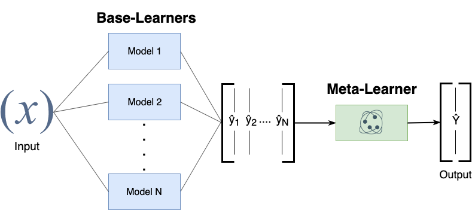

# DeepStack

DeepStack: Ensembling Deep Learning Models into the next Performance Level

[](https://travis-ci.com/jcborges/DeepStack) [](https://badge.fury.io/py/deepstack) [](https://pypistats.org/packages/deepstack)
---

DeepStack is a Python module for building Deep Learning Ensembles built originally on top of Keras and distributed under the MIT license.


## Installation
```
pip install deepstack
```

## Stacking
Stacking is based on training a Meta-Learner on top of pre-trained Base-Learners.
DeepStack offers an interface to fit the Meta-Learner on the predictions of the Base-Learners.
In the following an Example based on top of pre-trained Keras Models (there is also an interface for generic models):




#### Usage 

```python
from deepstack.base import KerasMember  # For a generic (i.e., Non-Keras Model) check the class `Member`
from deepstack.ensemble import StackEnsemble

model1 = ...  # A Keras pre-trained Model (Base-Learner)
train_batches1 =  ...  # A Keras Data Iterator - Training Data for Meta-Learner
val_batches1 =  ...  # A Keras Data Iterator - Validation Data for Meta-Learner
member1 = KerasMember(name="Model1", keras_model=model1, train_batches=train_batches1, val_batches=val_batches1)

model2 = ...  
train_batches2 =  ...  
val_batches2 =  ...  
member2 = KerasMember(name="Model2", keras_model=model2, train_batches=train_batches2, val_batches=val_batches2)

stack = StackEnsemble()
stack.add_member(member1)  # Assumption: the data iterators of base-learners iterate over the same data and have same shape and classes.
stack.add_member(member2)
stack.fit()  # Fits meta-learner based on training batches from its members (base-learners)
stack.describe()  # Prints information about ensemble performance based on validation data
```

Check an example on the CIFAR-10 dataset: [Cifar10.py](./examples/Cifar10.py).

## Randomized Weighted Ensemble
Ensemble Technique that weights the prediction of each ensemble member, combining the weights to calculate a combined prediction.  Weight optimization search is performed with randomized search based on the dirichlet distribution on a validation dataset. 

It follows the same interface of the StackEnsemble. An example can be found in [Cifar10.py](./examples/Cifar10.py).
